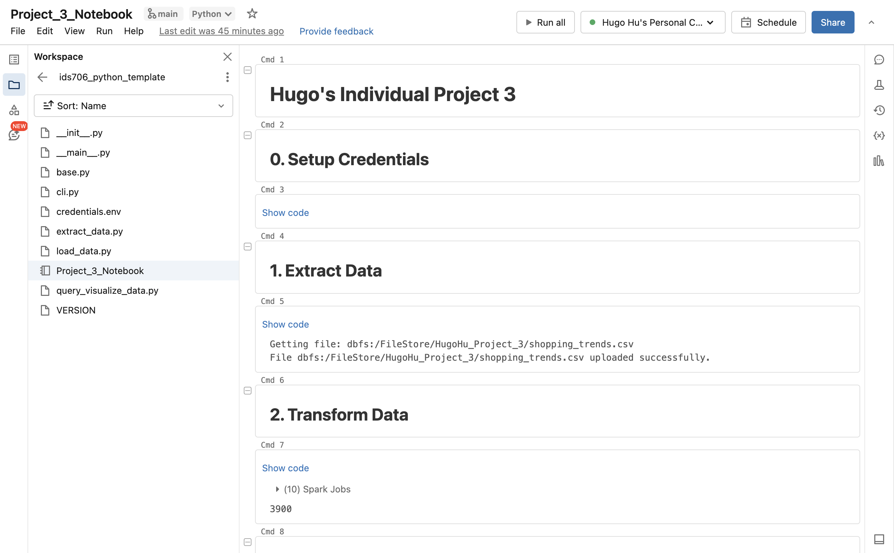
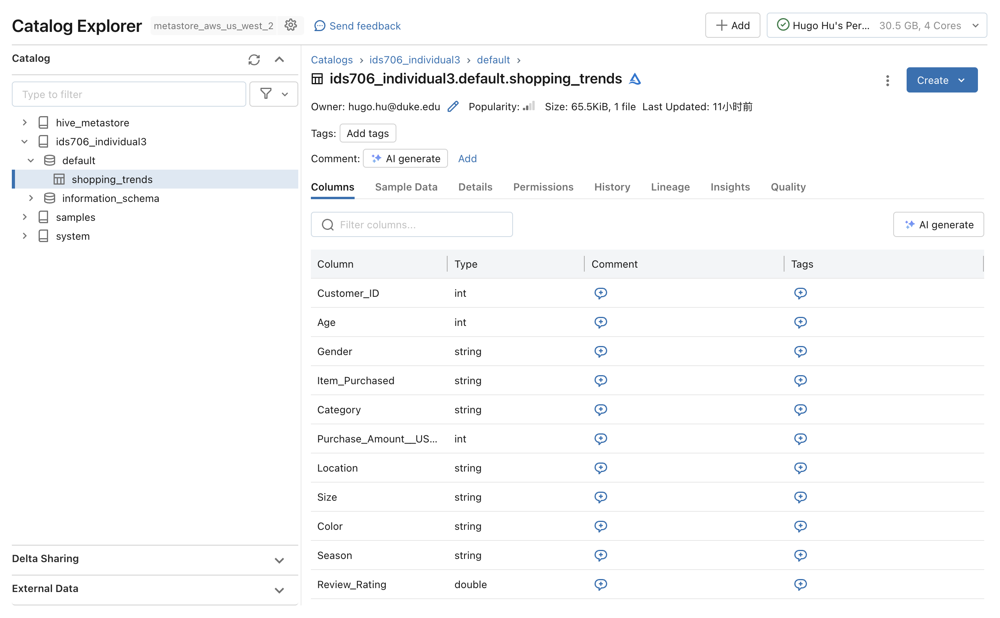
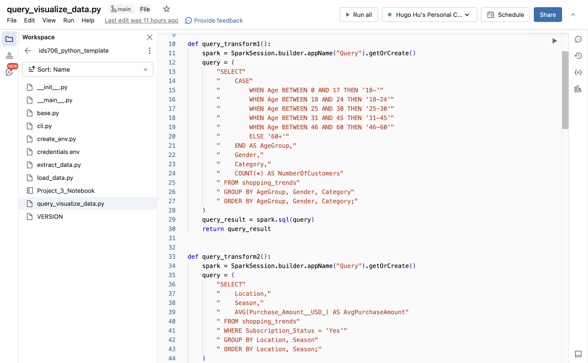
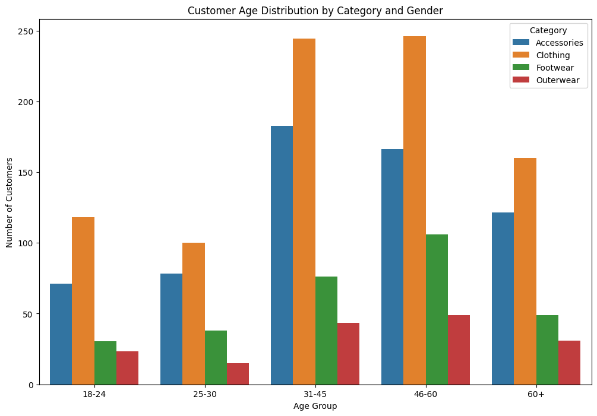
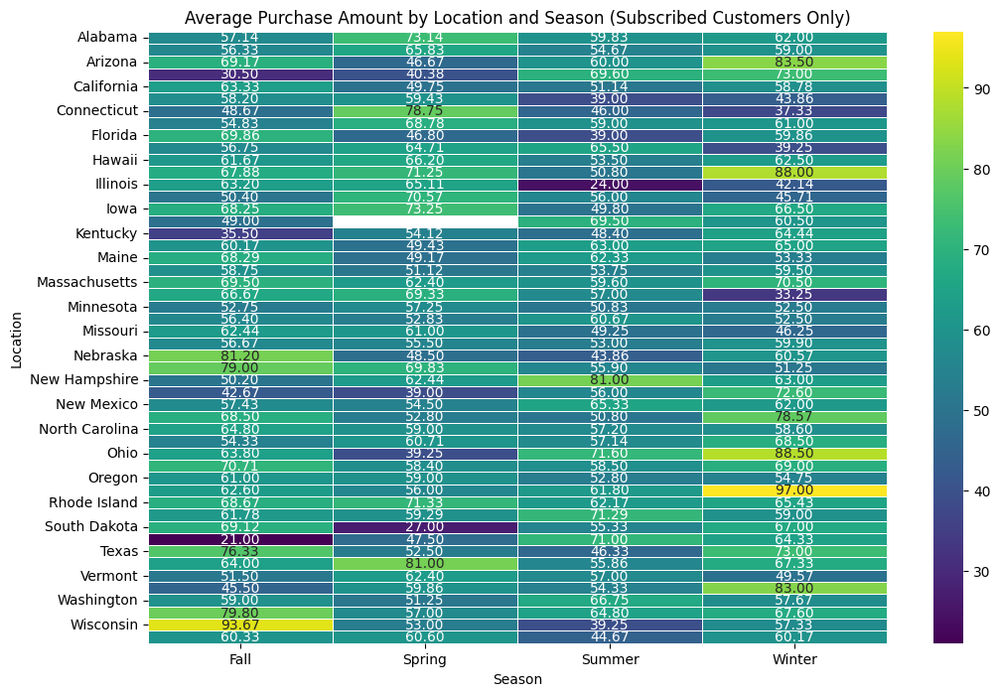
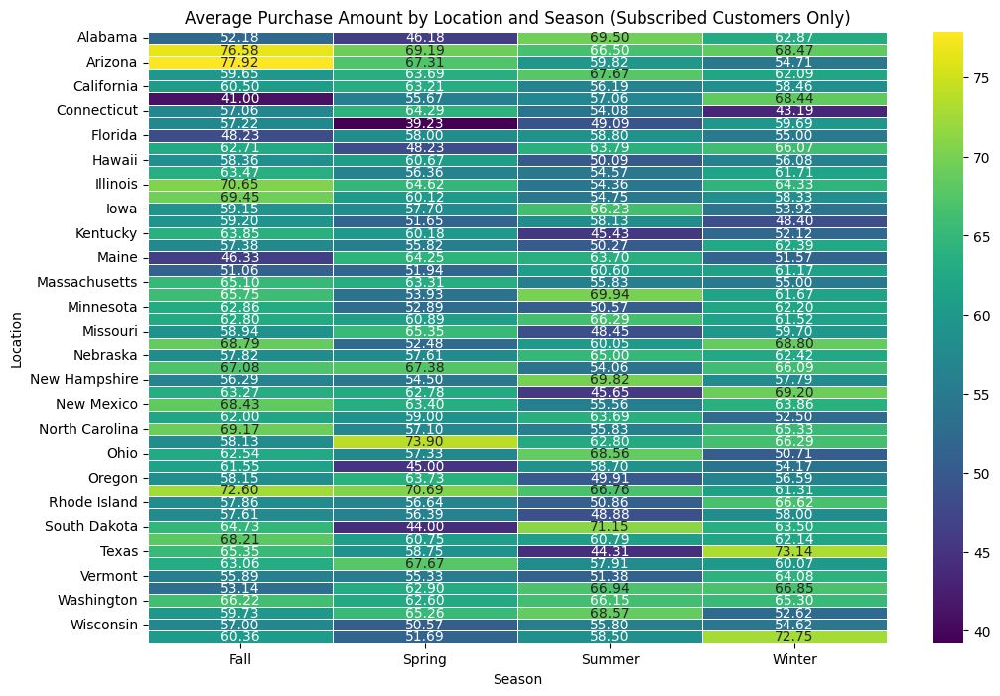
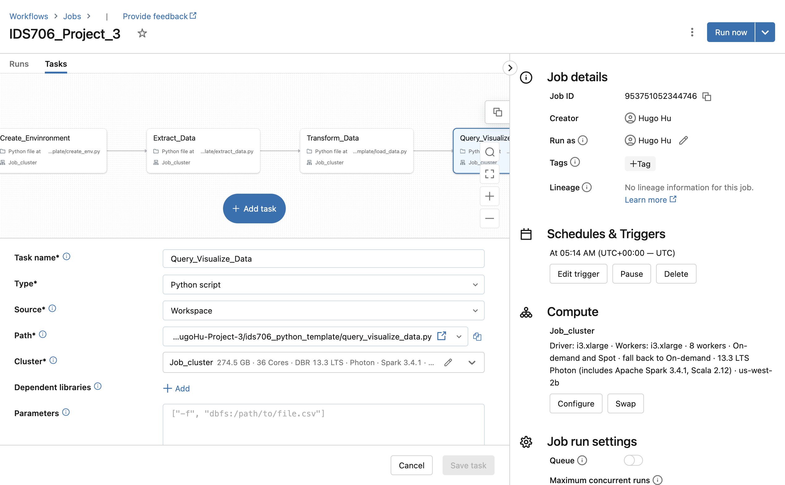

[](https://github.com/0HugoHu/HugoHu-Project-3/actions/workflows/lint.yml)
[](https://github.com/0HugoHu/HugoHu-Project-3/actions/workflows/rustfmt.yml)
[](https://github.com/0HugoHu/HugoHu-Project-3/actions/workflows/binary.yml)
[](https://github.com/0HugoHu/HugoHu-Project-3/actions/workflows/tests.yml)


[Youtube Video Here](https://youtu.be/tKc4hfgMkNs) 
&nbsp;&nbsp;


## Individual Project #3: Databricks ETL (Extract Transform Load) Pipeline

### 0. Description
This project uses the [Customer Shopping Trends Dataset](https://www.kaggle.com/datasets/iamsouravbanerjee/customer-shopping-trends-dataset/data) provided by Kaggle to analyze ```age``` and ```subscription``` factors vs. ```sales number``` and ```categories```. 
The dataset is stored in a CSV file and is loaded into a Databricks Delta Lake table. The data is then transformed using Spark SQL and the results are visualized using Databricks. 
The Databricks ETL Pipeline is setup by reusing the extract, transform, and query and visualization code.


### 1. How to run
Load this repo into your Databricks workspace and run the notebook.



The full notebook result (```.ipynb``` format) is **[here](Project_3_Notebook.ipynb)**.


### 2. Usage of Delta Lake
#### 2.1. Store Data
The dataset is stored in a CSV file and is loaded into a Databricks Delta Lake table.



#### 2.2. Data Validation
The data is validated by checking the number of rows in the Delta Lake table.
```python
df = query_transform1().toPandas()
if len(df) > 0:
    print(f"Data validation passed. {len(df)} rows available.")
else:
    print("No data available. Please investigate.")
```

### 3. Usage of Spark SQL
The data is transformed using Spark SQL for effective data analysis.

There are three SQL queries in this project:
1. ```query_transform1()```: This query analyzes Customer Age Distribution by Category and Gender
2. ```query_transform2()```: This query analyzes Average Purchase Amount by Location and Season, Considering Only Subscribed Customers
3. ```query_transform3()```: This query analyzes Average Purchase Amount by Location and Season, Considering Only Non-Subscribed Customers



### 4. Visualization and Conclusion
#### 4.1. Visualization
The results are visualized using Databricks Notebook.







#### 4.2. Recommendation
Based on the Age Distribution figure, all age groups spend money on the ```Clothing``` and ```Accessories``` categories.
So if you want to sell more products, you should focus on these two categories first.

Based on the Average Purchase Amount figure, the ```Winter``` season has the highest average purchase amount for subscribers, while
the ```Fall``` season has the highest average purchase amount for non-subscribers.
But overall, the holiday season (From Thanksgiving to New Year's Day) has the highest average purchase amount.

For state like ```North Carolina```, the purchase amounts are almost the same during a year, because the climate is mild and the seasons are not very distinct.

If you are companies in ```Arizona```, you should focus more on the ```Fall``` season.


### Databricks ETL Pipeline
The pipeline is set up by 4 steps:
1. Create Environment: Store the hostname and token in environment variables
2. Extract: Load the dataset into a Databricks Delta Lake table
3. Transform: Transform the data using Spark SQL
4. Query and Visualize: Visualize the results using Databricks Notebook

It is scheduled to run every day at 05:14 AM UTC.



### Conclusion
From this project, I learned how to use Databricks to analyze data and visualize the results. I also learned how to set up a Databricks ETL Pipeline to automate the process.

The result shows a fun fact that despite different age groups, people spend money on the ```Clothing``` and ```Accessories``` categories. And the holiday season has the highest average purchase amount.
